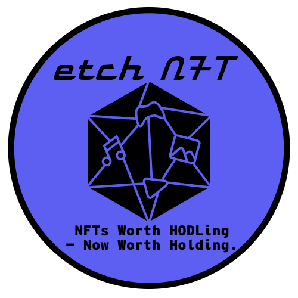

# ✨ EtchNFT Landing + Mini App

> Mint memories. Phygital drops sealed on-chain.  
> Built with Astro, Tailwind, and Cloudflare.



---

## 🚀 Features

- **⚡️ Astro + TailwindCSS** for fast, responsive theming
- **🎯 Cloudflare D1** for database-backed waitlists & orders
- **🔐 Cloudflare Workers** for custom API routes & rate-limiting
- **📬 Formaloo + Email Token Verification** built-in
- **📡 Solana API Integration** via Helius (coming live)
- **💖 Waitlist, roadmap, supporters, pitch & about pages**
- **🎨 Animations + Starfield + Dark Theme**

---

## 📂 Project Structure

```bash
src/
  assets/         # Images like star.png
  components/     # Shared UI components
  pages/          # All route-level .astro pages
  styles/         # Tailwind setup + globals
  index.ts        # Worker API logic (CF)
public/           # Static assets
migrations/       # D1 schema (init.sql)
🧪 Local Dev
bash
Copy
Edit
pnpm install
pnpm run dev
To test worker APIs locally:

bash
Copy
Edit
pnpm wrangler dev
🧱 Deployment
This project uses both:

🌐 Cloudflare Pages (for the Astro site)

☁️ Cloudflare Workers (for API + database)

Make sure to deploy both!

📖 License
MIT — Built with ❤️ by Cozyartz Media

EtchNFT isn’t just a drop. It’s a ritual.